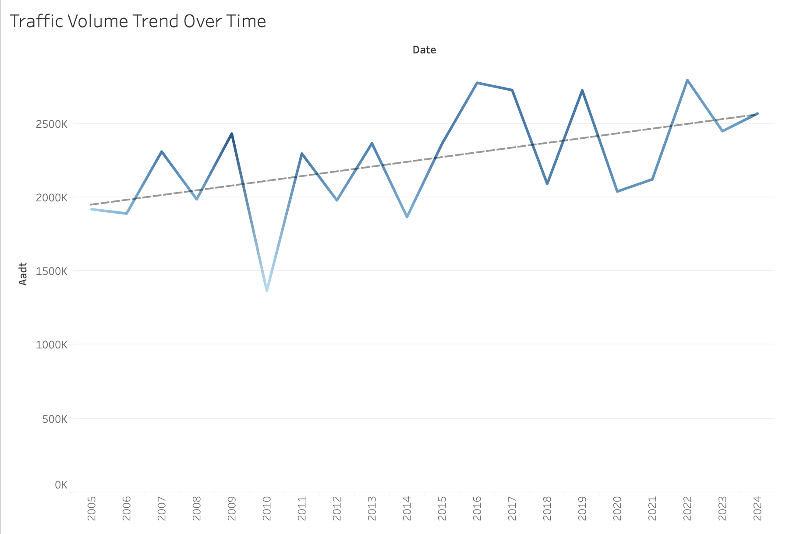
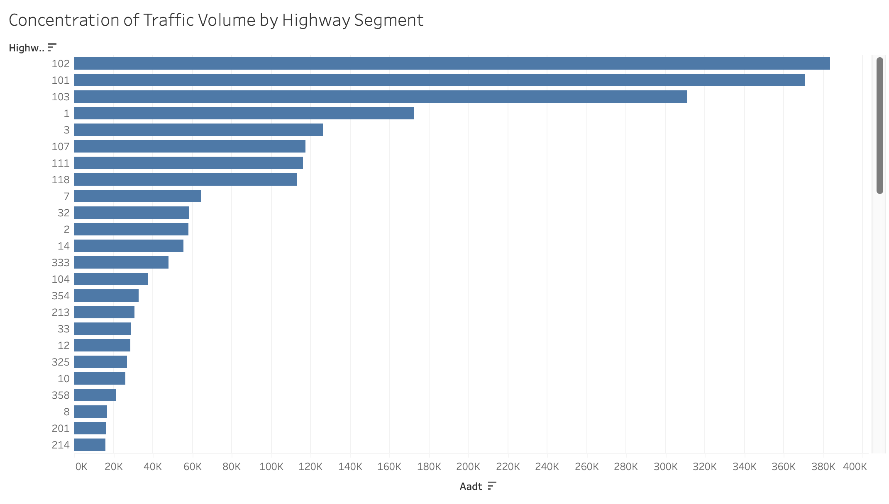
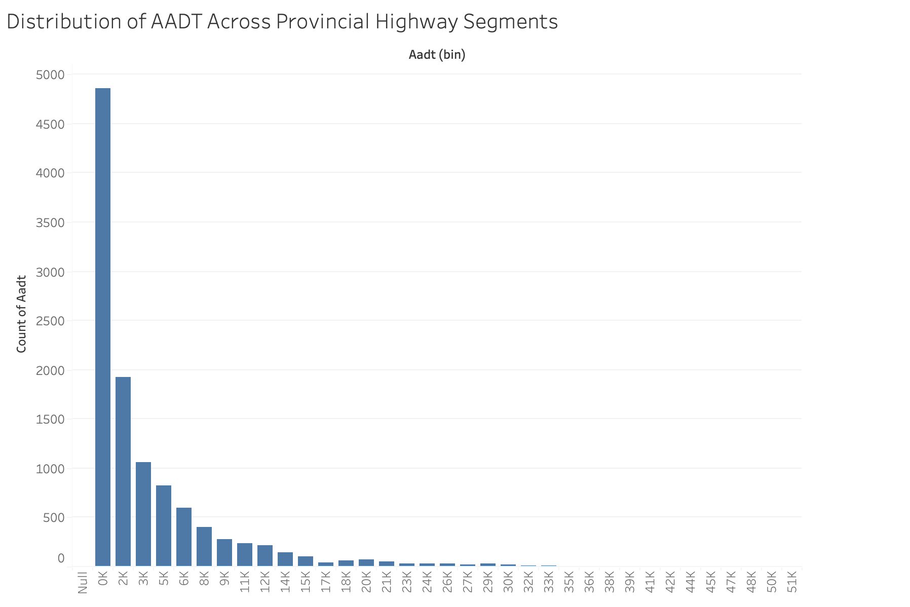
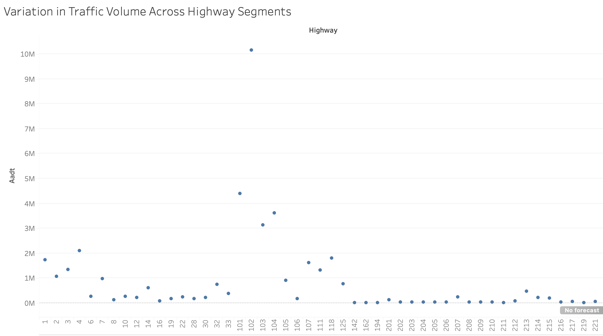
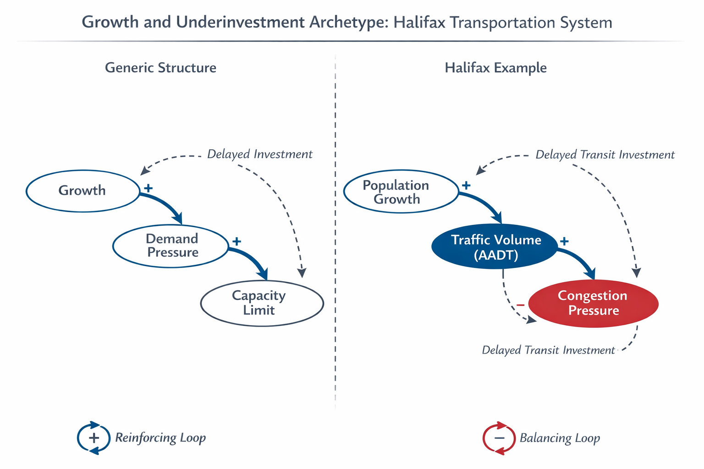

# Transit or Trails? A Decision Framework for Reducing Congestion and Emissions in Halifax

## Decision Statement

Should the Halifax Regional Municipality (HRM) transportation planning director prioritize investment in public transit expansion or active transportation infrastructure to reduce traffic volumes and congestion pressure by 2030?

## Primary Objective (KPI)

The primary objective of this analysis is to evaluate which investment pathway — public transit expansion or active transportation infrastructure — is more likely to reduce traffic volumes and congestion pressure within Halifax by 2030.

Traffic volume (AADT) is used as a measurable proxy for congestion pressure and private vehicle dependence within the Halifax transportation network.

## Executive Summary

Halifax Regional Municipality is experiencing sustained population growth alongside increasing pressure on its transportation system. Rising congestion, longer commute times, and transportation-related greenhouse gas emissions pose significant challenges to economic productivity, environmental sustainability, and quality of life. As HRM works toward climate targets and long-term urban development goals, transportation investment decisions have become increasingly consequential.

The transportation planning director faces a strategic allocation decision under constrained budgets and limited urban space. Two leading investment pathways dominate current policy discussions: expanding public transit services—such as increasing route coverage, frequency, and reliability—or prioritizing active transportation infrastructure, including protected bike lanes and pedestrian-oriented streets. While both strategies aim to reduce reliance on private vehicles, they differ in cost structures, adoption timelines, equity implications, and system-wide impacts.

This project frames the decision as a system dynamics problem rather than a narrow infrastructure comparison. Transportation outcomes emerge from interconnected feedback loops involving congestion, mode choice, emissions, land use, and public support. By integrating background research, exploratory data analysis, and causal loop modeling, this project seeks to identify which investment pathway offers the greatest leverage for achieving HRM’s congestion and emissions reduction objectives by 2030, while acknowledging uncertainty and tradeoffs inherent in urban transportation systems.

[Read more](Background.md)

## Initial Causal Loop Diagram (Draft)

### Key Feedback Loops (Draft)
- **Reinforcing Loop (R1 – Transit Quality Loop):** Increased transit investment improves service quality, which raises ridership. Higher ridership increases political and financial support for transit, enabling further investment.
- **Reinforcing Loop (R2 – Active Transportation Adoption Loop):** Expanded active transportation infrastructure improves perceived safety and accessibility, increasing walking and cycling rates and generating demand for additional infrastructure.
- **Balancing Loop (B1 – Congestion Pressure / Induced Demand Loop):** Reduced car usage lowers congestion, but improved traffic conditions can induce additional driving, partially offsetting congestion reductions.

## Evidence Supporting Key Causal Links

1. The increasing or sustained AADT trend (Figure 1) supports the positive relationship between private vehicle use and traffic volume.

2. The concentration of traffic in specific corridors (Figure 2) supports the link between infrastructure capacity and congestion pressure.

3. The distribution and variation in traffic intensity (Figures 3 and 4) reinforce the reinforcing feedback loop between vehicle dependence and road utilization.

## Exploratory Visualizations

### Figure 1: Traffic Volume Trend Over Time

**Interpretation:**  
Figure 1 shows the trend in Annual Average Daily Traffic (AADT) across Halifax-area highway segments. The observed pattern indicates sustained vehicle reliance, reinforcing the system’s dependence on private automobile use. Increasing traffic volumes strengthen congestion pressure and support the reinforcing loop identified in the causal model.

---

### Figure 2: Concentration of Traffic Volume by Highway Segment

**Interpretation:**  
Figure 2 highlights the highway corridors with the highest traffic volumes. Traffic concentration across specific segments suggests that congestion pressure is spatially clustered. This supports the causal link between infrastructure capacity and vehicle flow intensity.

---

### Figure 3: Distribution of AADT Across Provincial Highway Segments

**Interpretation:**  
Figure 3 illustrates the distribution of AADT values across highway segments. The distribution indicates that while many segments carry moderate traffic, a smaller subset carries disproportionately high volumes. This imbalance supports the system dynamics framing of concentrated congestion pressure.

---

### Figure 4: Variation in Traffic Volume Across Highway Segments

**Interpretation:**  
Figure 4 explores variation in traffic volume across segments (or over time, depending on your scatterplot). The observed relationship suggests that certain structural or temporal factors influence traffic intensity, reinforcing feedback mechanisms in the refined causal loop diagram.

---

# Milestone 3: Path A (System Focus) - System Analysis & Scenario Development

## System Archetype Identification

The system underlying traffic congestion in Halifax most closely reflects the **“Growth and Underinvestment” archetype**.

In this system, increasing traffic demand (driven by population growth and vehicle dependence) places pressure on infrastructure capacity. As traffic volumes increase, congestion worsens. While investment in alternative transportation (transit and active modes) could alleviate this pressure, such investment is often delayed or insufficient relative to system growth.

Key variables in this archetype include:
- Traffic Volume (AADT)
- Infrastructure Capacity
- Transit & Active Investment
- Private Vehicle Use
- Congestion Pressure

The reinforcing loop of vehicle dependence drives continued traffic growth, while delayed investment in alternatives prevents the system from adapting effectively.

Evidence from Milestone 2 supports this structure:
- Traffic volume trends (Figure 1) show sustained or increasing AADT
- High-volume corridors (Figure 2) indicate concentrated congestion pressure
- Distribution patterns (Figure 3) show imbalance across the system
- Variation across segments (Figure 4) highlights differences in traffic demand

This reflects a system approaching capacity limits without sufficient structural intervention.

## System Archetype Diagram

This diagram illustrates the “Growth and Underinvestment” archetype as applied to Halifax’s transportation system. Increasing traffic demand places pressure on infrastructure capacity, while delayed investment in alternative transportation limits the system’s ability to adapt.

---

## Scenario Narratives

### Scenario 1: Status Quo (No Significant Policy Change)

If Halifax continues current transportation policies without significant investment shifts, traffic volumes are likely to continue increasing over the next 5–10 years. Population growth and ongoing reliance on private vehicles will reinforce existing system dynamics. As traffic volumes rise, congestion pressure will increase, particularly in already high-volume corridors identified in the data.

The reinforcing loop of vehicle dependence will remain dominant, where increased road use leads to further infrastructure demand and continued reliance on cars. While minor improvements or incremental infrastructure changes may occur, they are unlikely to offset system-wide growth.

Over time, this may result in longer travel times, reduced system efficiency, and increased environmental impact. Congestion may also begin to act as a balancing force by discouraging travel or shifting behavior, but this occurs only after system performance has degraded.

Key uncertainties include the rate of population growth and potential external policy changes, but overall, the system is expected to worsen under this scenario.

---

### Scenario 2: Public Transit Investment (Intervention A)

In this scenario, Halifax prioritizes investment in public transit infrastructure, including expanded routes, improved frequency, and increased accessibility. Over time, this improves the attractiveness and feasibility of transit as an alternative to private vehicle use.

As transit adoption increases, private vehicle use begins to decline, reducing traffic volumes (AADT) across key corridors. This weakens the reinforcing loop of car dependence and activates a new reinforcing loop where improved transit leads to increased ridership, further justifying continued investment.

Over a 5–10 year period, this could result in measurable reductions in traffic volume, particularly in high-demand commuting corridors. Congestion pressure decreases, and system efficiency improves.

However, implementation requires significant upfront investment and depends on user adoption. If ridership does not increase as expected, benefits may be delayed.

---

### Scenario 3: Active Transportation Investment (Intervention B)

In this scenario, Halifax prioritizes active transportation infrastructure such as bike lanes, pedestrian pathways, and urban design improvements. These investments increase accessibility for short-distance travel and improve local mobility.

This leads to modest reductions in private vehicle use, particularly for short trips. However, the overall impact on system-wide traffic volume is more limited due to the constraints of distance and commuting patterns.

The system experiences localized improvements, especially in urban cores, but high-volume corridors driven by longer commutes remain largely unaffected.

Over time, active transportation contributes to sustainability and quality of life, but does not significantly alter the dominant reinforcing loop of vehicle dependence.

Uncertainty exists around adoption rates and seasonal usage patterns, which may affect long-term impact.

---

## Leverage Point Analysis

The most effective leverage point in this system is:

> **Reducing private vehicle dependence through improved transit accessibility**

This leverage point has high impact because it directly influences the reinforcing loop driving traffic volume growth. By making transit a viable alternative, the system shifts away from car dependence.

This intervention affects multiple variables:
- Decreases private vehicle use
- Reduces traffic volume (AADT)
- Lowers congestion pressure
- Increases public support for sustainable infrastructure

It also weakens the dominant reinforcing loop and strengthens an alternative loop centered on transit adoption.

Potential risks include:
- Public resistance to behavioral change
- High capital costs
- Delayed benefits if adoption is slow

Despite these risks, this leverage point offers the strongest system-wide impact relative to effort.

---

## Implications for the Decision

The analysis indicates that Halifax’s transportation system is currently characterized by reinforcing growth in traffic volumes without sufficient investment in alternative infrastructure.

Among the scenarios, public transit investment emerges as the most effective strategy for reducing congestion pressure at a system-wide level. While active transportation provides important localized benefits, it does not significantly alter high-volume commuting patterns that drive congestion.

The status quo scenario leads to continued system degradation, reinforcing the need for intervention.

Key uncertainties remain around adoption rates, funding constraints, and implementation timelines. However, the direction of impact across scenarios is clear.

This analysis suggests that prioritizing transit investment, supported by complementary active transportation strategies, offers the strongest pathway for improving system performance.

---

# Milestone 4: Final Decision & Recommendations

## Final Recommendation

Based on the combined analysis from Milestones 1–3, it is recommended that:

> **Halifax Regional Municipality prioritize public transit expansion as the primary strategy to reduce traffic volumes (AADT) and congestion pressure, while supporting active transportation as a complementary investment.**

---

## Justification

This recommendation is supported by three key findings:

1. **Concentration of Traffic Demand**  
   Exploratory analysis shows that traffic volume is concentrated in a small number of high-demand corridors. Reducing congestion in these areas requires an intervention that can influence large-scale commuting behavior.

2. **System-Level Impact of Transit**  
   Public transit has the ability to shift longer-distance trips away from private vehicles, making it more effective at reducing overall traffic volume compared to active transportation alone.

3. **Leverage Point Alignment**  
   The system analysis identified reducing private vehicle dependence as the most effective leverage point. Transit investment directly targets this by providing a viable alternative to car use.

---

## Implementation Considerations

To successfully apply this recommendation, decision-makers should:

- Prioritize transit improvements in high-volume corridors  
- Increase service frequency and accessibility  
- Align active transportation investments with first-mile and last-mile connections  
- Ensure investments are phased to match population growth and demand  

---

## Key Uncertainties

Several uncertainties may affect outcomes:

- Transit adoption rates may vary depending on service quality and coverage  
- Infrastructure funding constraints may limit the speed of implementation  
- Travel behavior may not shift as quickly as expected  

Despite these uncertainties, the overall direction of impact remains consistent across scenarios.

---

## Limitations

This analysis has several limitations:

- AADT is used as a proxy for congestion and does not directly measure travel time or delay  
- Available data focuses on traffic volume rather than detailed travel behavior  
- The system analysis is conceptual and does not quantify exact future outcomes  

---

## Future Work

Future analysis could improve this project by:

- Incorporating transit ridership and commute time data  
- Conducting corridor-level analysis of congestion and modal shifts  
- Evaluating hybrid investment strategies in greater detail  

---

## Conclusion

Reducing congestion in Halifax requires addressing the underlying structure of private vehicle dependence. While both transit and active transportation provide benefits, public transit investment offers the strongest system-wide impact. Supporting this with targeted active transportation infrastructure provides a balanced and effective long-term strategy.
